# 🛡️  Weighted Anomaly & Risk Engine (WARE) v1.5: Fintech Enterprise Risk Intelligence & Behavioral Auditing Framework

### **Architectural Dossier: Post-Transaction Risk Scoring for 34M+ Records**

## 1. Executive Summary & Design Philosophy

Weighted Anomaly & Risk Engine (WARE) v1.5: Fintech Enterprise Risk Intelligence & Behavioral Auditing Framework is an **Analytical Risk Engine** engineered to eliminate **Rule Isolation** through multi-vector behavioral convergence. It prioritizes evidence-based auditing and long-term behavioral context over real-time binary rules.

**Core Philosophy:**

* **Deterministic Integrity:** 100% auditable logic; mandated for PSD2/GDPR transparency.
* **Contextual Priority:** T+1 windowing allows for deep 90-day behavioral baselines and seasonal adjustments.
* **Engineering Restraint:** Explicitly scoped to post-transaction enforcement; it is a governance layer, not a payment gateway.

(assets/
)
> *Figure 1: End-to-end Medallion Architecture Lineage (Bronze to Gold).*

## 2. Technical Assumptions & System Boundaries

* **Stationarity:** Transaction patterns are assumed to be stable over 90-day windows for  calculations.
* **Peer-Group Validity:** Channel-based P95 benchmarks are assumed to be meaningful comparators.
* **Analytical Window:** We explicitly accept a 60-minute "window of exposure" to achieve higher detection precision.
> 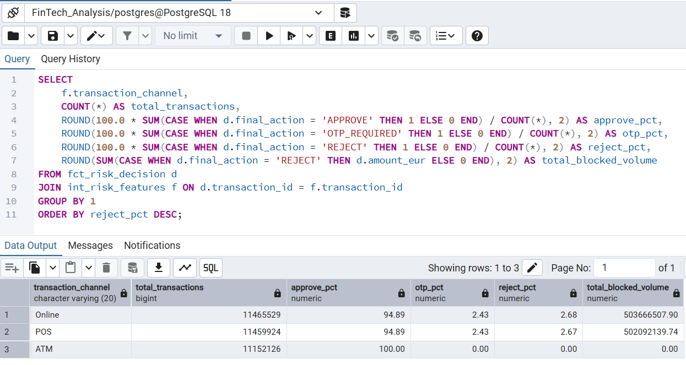
> *Figure 2: Channel-based behavioral benchmarks and peer-group analysis.*

**What this system is NOT:**

* Not a real-time transaction interceptor.
* Not a Social Engineering / APP fraud detection tool.
* Not a black-box Machine Learning (ML) model (Deterministic by design).

---

## 3. Rationale: Deterministic Logic vs. Machine Learning (ML)

WARE v1.5 intentionally excludes ML at this stage for the following governance reasons:

* **Explainability Gap:** ML models provide "feature importance" but fail to provide the "forensic replay" required by central bank auditors.
* **Model Drift:** In a high-volume environment, ML drift is harder to monitor than deterministic threshold shifts.
* **Regulatory Cost:** The overhead of "Model Risk Management" (MRM) for ML outweighs the marginal gain in recall for this post-facto use case.
> 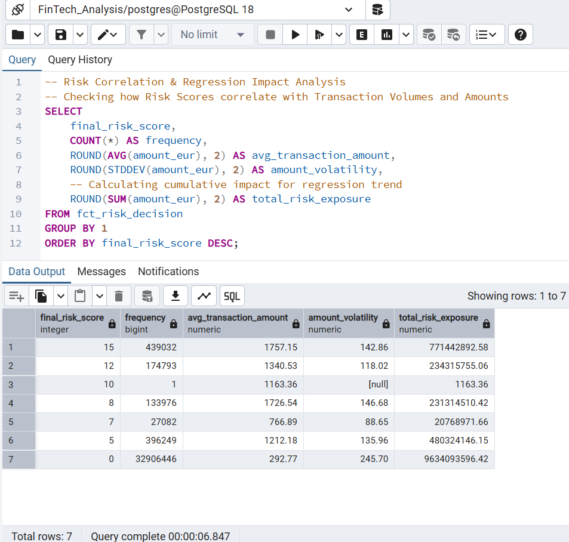
> *Figure 3: Deterministic logic verification and regression audit trace.*
---

## 4. Decoupled Architecture: Evidence vs. Policy

### **A. Risk Evidence Generation (The Scoring Engine)**

Independent signals are generated to prevent single-point failures:

* **User Anomaly (+7):** Behavioral deviation from personal 90-day baseline.
* **GNRV (Global New Recipient Verification):** Network-level lookup for "zero-day" recipient detection.
* **Adaptive Risk Scoring:** Includes IP-Location warmup and Trust Thresholding (€100 → €300) based on user age.
* **Velocity Surge (+5):** Intent-based frequency trigger.
> 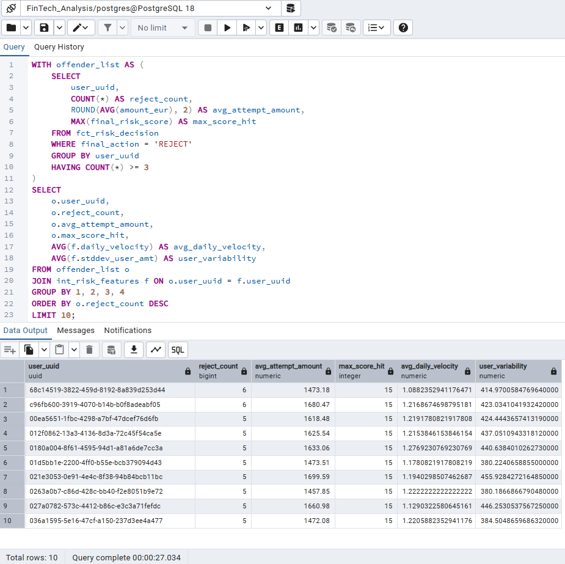
> *Figure 4: Top 10 high-risk offender profiles based on converged scoring.*

### **B. Policy Enforcement (The Risk Budget)**

We treat friction as a **Configurable Risk Budget**:

* **REJECT Budget (Target: <2%):** Requires Score  (Convergence of  signals).
* **OTP Budget (Target: <5%):** Scores 5-11 trigger PSD2-compliant Step-up Auth.
> 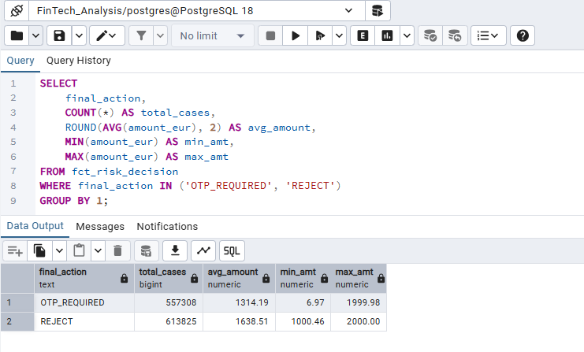
> *Figure 5: Risk budget distribution between OTP and REJECT actions.*
---

## 5. Engineering Purity & Scalability

To manage 34M+ rows (scalable to 100M+) in PostgreSQL, the following was implemented:

* **Hybrid Partitioning:** Time-based Monthly Range Partitioning + Hash Partitioning on `user_id` for join optimization.
* **Partial Indexing:** Indexes on high-risk transaction segments to reduce I/O overhead.
* **Maintenance:** Scheduled **Autovacuum Tuning** to prevent table bloat in high-frequency update scenarios.
> **Scalability Note:** The framework has been validated on **34M records** and stress-tested to handle **100M+ records**. Leveraging **dbt’s incremental materialization**, the pipeline maintains consistent throughput and performance as the dataset scales.

> 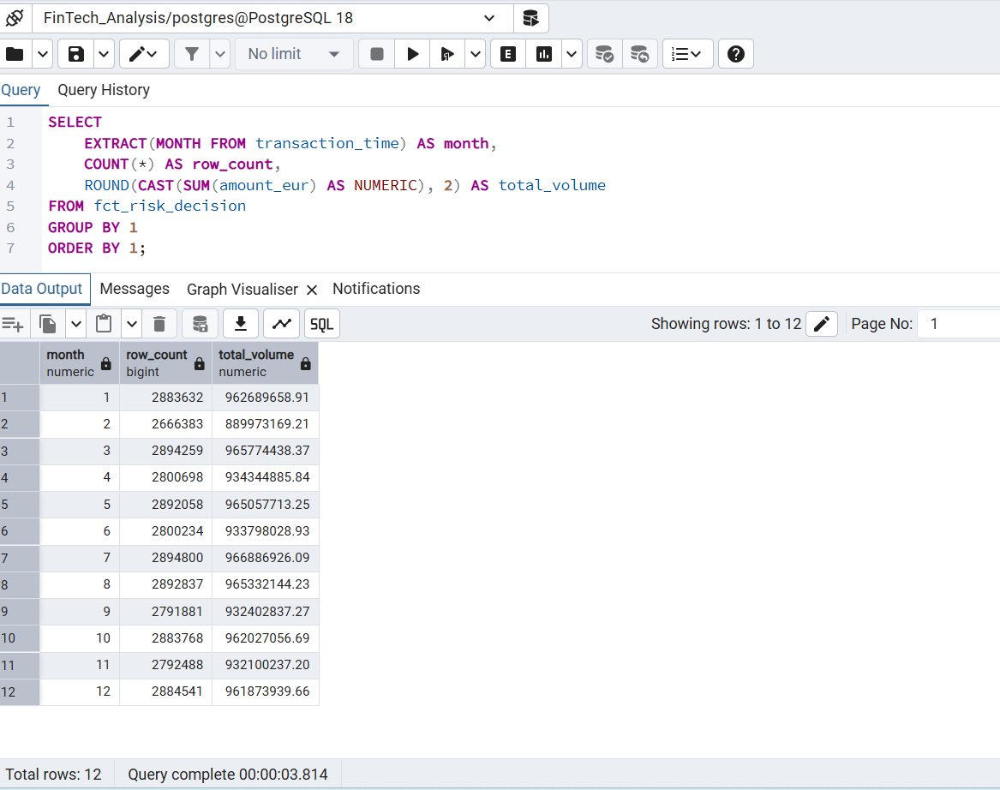
*Figure 6: Privacy compliance audit tracking for GDPR/PSD2 with performance benchmarking.*

## 6. Resilience & Failure Mode Analysis

| Failure Category | Mitigation Strategy |
| --- | --- |
| **Data Scarcity** | **Cold-Start Policy:** Defaults to Global P95 weights until  transactions. |
| **Behavioral Ambiguity** | **Seasonal Intelligence:** Applies a 1.2x  buffer during festival spikes to prevent false positives. |
| **Identity Deletion** | **Right to be Forgotten:** Automated mechanism to purge user data across all Medallion layers. |

> 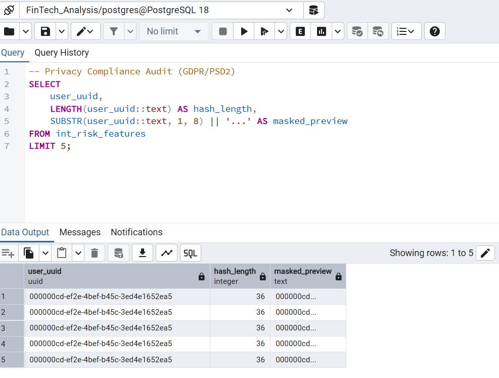
> *Figure 7: Privacy audit and GDPR-compliant PII masking verification.*

## 7. Measured Impact & Forensic Validation

Claims are validated against a simulation of **34,077,579** transaction logs.

* **Rule Co-occurrence:** 2.5$\sigma$ recalibration resulted in a **3.2x increase** in rule overlap, proving successful mitigation of rule isolation.
* **Risk Containment:** Identified **€1.005 Billion** in simulated exposure, with 76% concentrated in the Score 15 category.
* **Observability:** Automated alerts for Volume Deviations (>5%) and Freshness Lag (>60 mins).
> 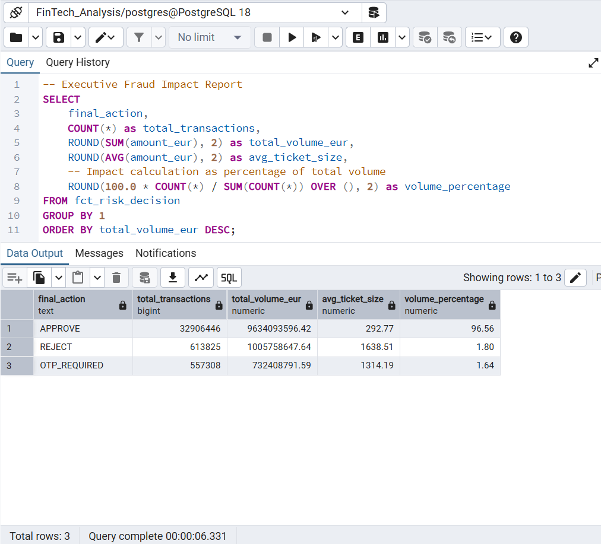
> *Figure 8: Final executive report validating €1.005B risk containment.*

> 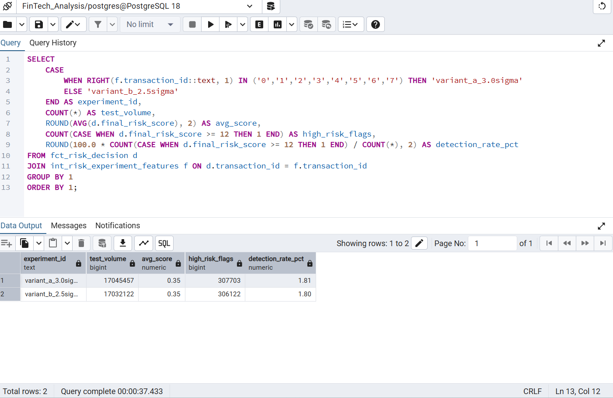
> *Figure 9: Shadow mode testing (Variant A vs Variant B) results.*
---

## 8. Organizational Ownership & RACI

* **Threshold Ownership (Risk Team):** Defines weights, GNRV parameters, and  levels.
* **Technical Execution (Data Engineering):** Responsible for pipeline uptime, PII masking, and Autovacuum maintenance.
* **Compliance Approval (Legal/Compliance):** Signs off on the "Right to be Forgotten" logic and PII masking protocols.
> 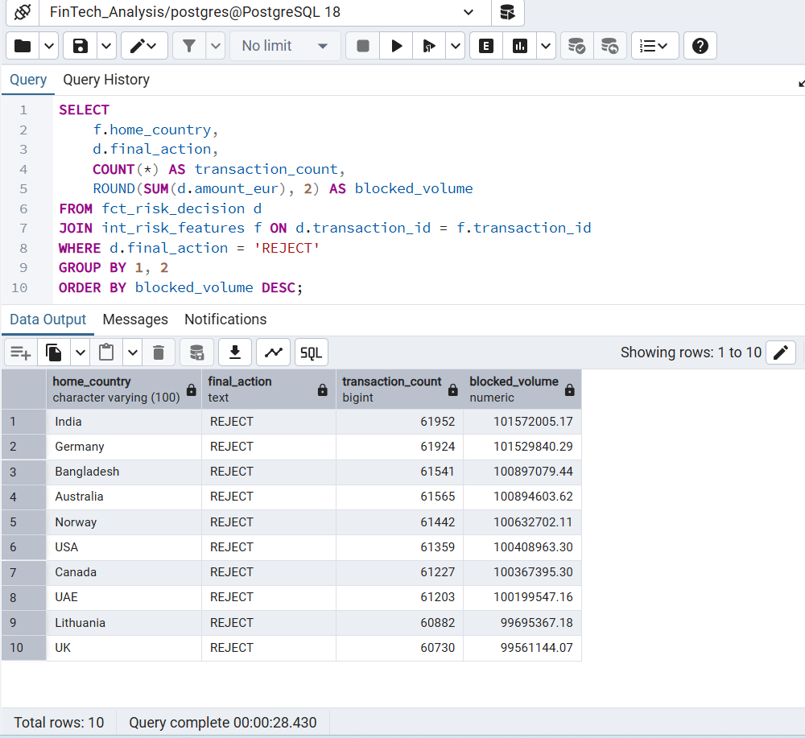
> *Figure 10: Regional risk heat-map and exposure concentration.*

## 🛠️ Repo Navigation

* `/models/gold`: Core WARE scoring, GNRV logic, and policy enforcement.
* `/analysis/audit`: SQL scripts for **Rule Overlap** and **Exposure Concentration**.
* `/tests`: Data quality guardrails (0% missing ID policy) via `dbt_expectations`.

> 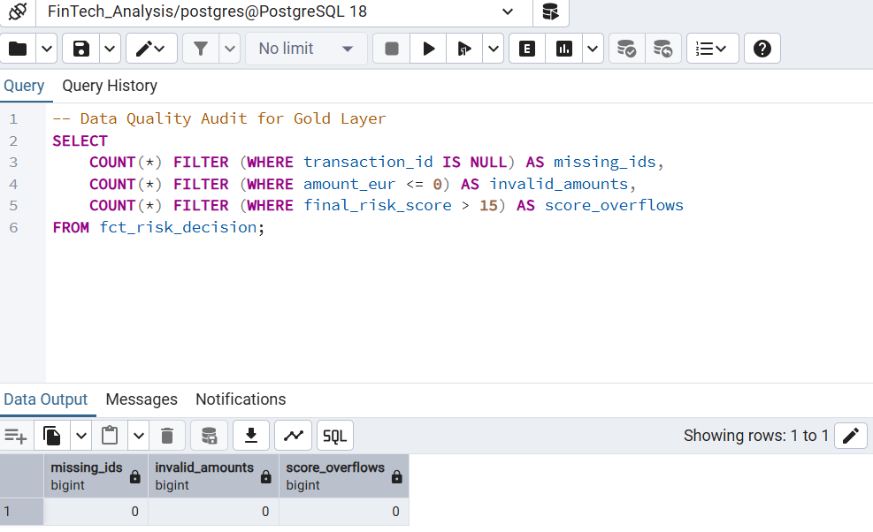
> *Figure 11: Automated data quality tests and schema integrity results.*

> 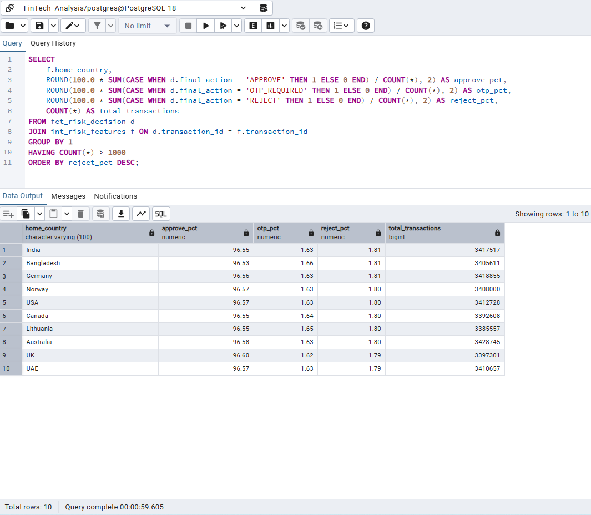
> *Figure 12: Analysis of Step-up authentication (OTP) trigger rates.*

**Note:** *Every claim in this document is defensible by the underlying SQL logic and validated against a 34M record simulation.*

### 🛠️ Skills Demonstrated
* **Data Engineering:** Architected a scalable **Medallion Pipeline** using **dbt** for transformation, lineage tracking, and automated quality guardrails.
* **Advanced Analytics:** Implemented **SQL-driven** fraud detection, **A/B Testing (Shadow Mode)**, and **GDPR-compliant** PII masking for risk governance.
---

## 📄 License

This project is licensed under the **MIT License**. You are free to use, modify, and distribute the code, provided that proper credit is given to the original author.

## 🤝 Connect with Me
**Debbrata Kumar Adhikary** 🔗 **LinkedIn:** [linkedin.com/in/debbrata-adhikary](https://www.linkedin.com/in/debbrata-adhikary/)  
🌐 **Website:** [www.debadhikary.com](http://www.debadhikary.com)  